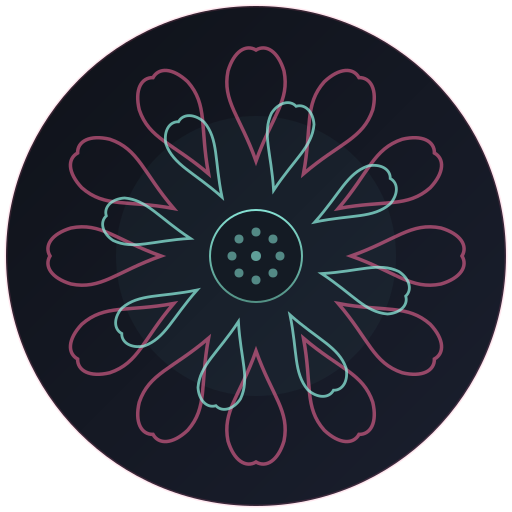

# 忘·言 AI | ZenVocab AI

<p align="center">
  
</p>

<p align="center">
  <strong>Obsidian 中英双语 AI 词汇学习插件</strong><br/>
  拾取单词，AI 深度解析，多通道记忆，词库管理 — 让每个单词"长"在脑子里。
</p>

<p align="center">
  
  
  
</p>

---

## ✨ 功能特性

### 🤖 AI 智能解析
- **词汇深度解析** — 粘贴段落，AI 自动提取核心词汇，生成词源故事、多通道记忆法、近义词辨析、高频搭配、实战例句
- **句子翻译工坊** — 粘贴句子，AI 提供地道翻译 + 直译对比 + 语法拆解 + 句型内化 + 时态语态分析
- 支持 **DeepSeek** / **OpenAI** 及所有 OpenAI 兼容 API

### 📚 词库 & 句库管理
- 双模式切换（Word / Sentence），独立存储路径
- 本地 Markdown 存储，完全离线可用
- 标记重点、浏览历史、全文搜索、TTS 发音

### 🧭 时空罗盘
- 按日 / 周 / 月 / 年归档查看学习记录
- 热力图直观展示学习密度
- 点击任意日期跳转到当天笔记

### 🎨 禅风 UI
- BuJo 植物美学设计语言
- 青蛙 / 薄荷池塘 / 夜色池塘 三套内置主题
- 支持自定义调色板
- 纯享模式 / 沉浸模式

### 🧠 多通道记忆工坊
- **荒诞故事法** (A) — 把单词编进离奇故事
- **视觉爆破法** (B) — 用动态画面编码词义
- **声音锚定法** (C) — 中文谐音桥 + 节奏口诀
- **身体编码法** (D) — 手势动作锚定记忆
- **图像代码法** (E) — 字母→图像→荒诞故事链，把抽象符号变成过目不忘的画面

---

## 📦 安装

### 手动安装
1. 下载 [最新 Release](https://github.com/krisztiantsui/obsidian-zen-vocab-ai/releases)
2. 将 `main.js`、`manifest.json`、`styles.css` 放入 vault 的 `.obsidian/plugins/obsidian-zen-vocab-ai/` 目录
3. 在 Obsidian 设置 → 第三方插件中启用「忘·言 AI | ZenVocab AI」

### 通过 BRAT
1. 安装 [BRAT](https://github.com/TfTHacker/obsidian42-brat) 插件
2. 添加 Beta 插件：`krisztiantsui/obsidian-zen-vocab-ai`

---

## ⚙️ 配置

| 设置项 | 说明 |
|--------|------|
| **API Key** | DeepSeek 或 OpenAI 兼容 API 的密钥 |
| **Base URL** | API 端点（默认 `https://api.deepseek.com`） |
| **Model** | 模型名称（默认 `deepseek-chat`） |
| **词汇存储路径** | Markdown 词库文件位置 |
| **句子存储路径** | Markdown 句库文件位置 |
| **启用图像代码法** | 在 AI 解析中开启方法E（字母→图像→故事链） |
| **代码库文件路径** | 图像代码库 Markdown 文件位置（默认 `Vocab/Image_Code_Library.md`） |

---

## 🚀 使用方式

1. 点击左侧 Ribbon 栏莲花图标打开插件面板
2. 在输入框中粘贴英语单词/句子/段落
3. 点击 **Parse**（词汇模式）或 **Translate**（句子模式）
4. AI 生成深度解析卡片 → 点击 **📚 存入词库** 保存
5. 点击卡片展开/收拢详情，使用工具栏筛选归档

---

## 🧱 开发

```bash
git clone https://github.com/krisztiantsui/obsidian-zen-vocab-ai.git
cd obsidian-zen-vocab-ai
npm install
npm run dev    # 开发模式 (watch)
npm run build  # 生产构建
```

复制 `main.js`、`manifest.json`、`styles.css` 到你的 Obsidian vault `.obsidian/plugins/obsidian-zen-vocab-ai/` 目录即可测试。

---

## ☕ 支持

如果这个插件对你的英语学习有帮助，欢迎请我喝杯咖啡：

<p align="center">
  <a href="https://buymeacoffee.com/krisztiantsui" target="_blank">☕ Buy Me a Coffee</a>
  &nbsp;&nbsp;|&nbsp;&nbsp;
  💙 支付宝 (扫码)
  &nbsp;&nbsp;|&nbsp;&nbsp;
  💚 微信赞赏 (扫码)
</p>

---

## 📄 License

MIT © [krisztiantsui](https://github.com/krisztiantsui)
